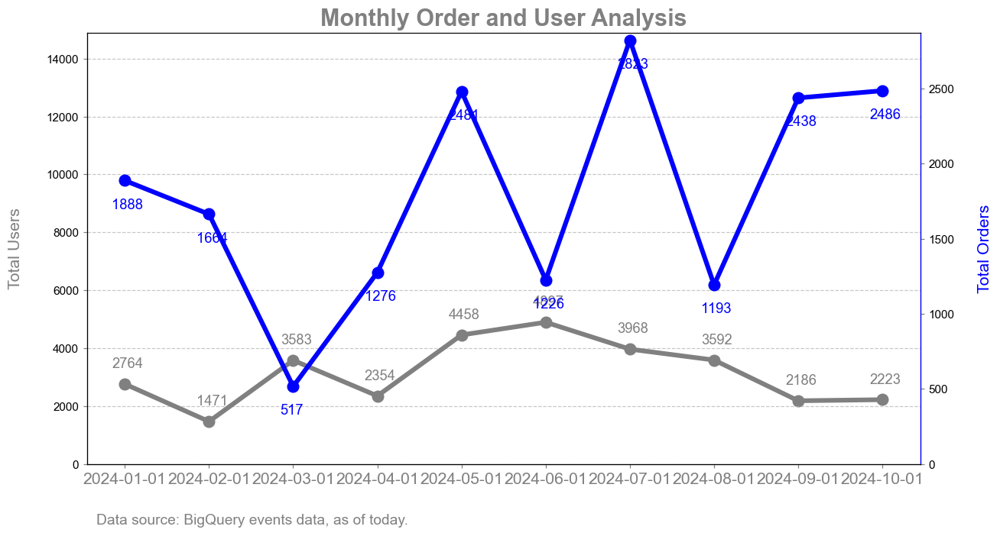
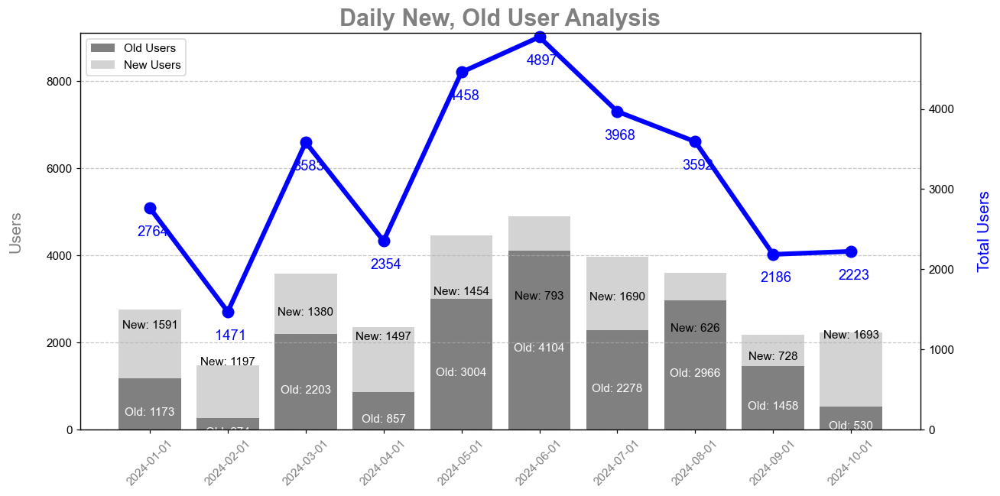

# Storytelling with Data using BigQuery Events Data

## Project Overview

This project focuses on leveraging BigQuery events data to extract meaningful insights about user behavior and engagement over time. By employing **storytelling with data** principles, we aim to visualize key trends and patterns that drive decision-making for user retention, engagement, and monetization strategies.

### Objectives:
1. **User Engagement Analysis**: Understand user behavior over time, including the distinction between new and returning (old) users.
2. **Purchase Behavior**: Identify how users convert through in-app purchases and analyze the trend of total orders across various months.
3. **Retention Trends**: Track how returning users (old users) maintain engagement compared to new users and how they contribute to orders.
4. **Data-Driven Storytelling**: Present the data in clear, engaging charts and visualizations that communicate insights effectively.

## Data Source

The data comes from BigQuery, specifically pulling event data from Google Analytics or any related user interaction data source. The query is structured to retrieve the following key metrics from the data:

- **Total Users**: Unique users interacting with the platform within a given month.
- **New Users**: Users who engaged for the first time in the given month.
- **Old Users**: Returning users who had their first interaction before the current month.
- **Total Orders**: Count of distinct users who made an in-app purchase during the month.

## Methodology

### Data Structure

The query extracts monthly data and categorizes it into:
- **Total Users**: All unique users interacting in the platform within a given month.
- **New Users**: First-time users identified by their first engagement.
- **Old Users**: Returning users who had previously interacted before the given month.
- **Total Orders**: Count of in-app purchases made by users in each month.



### SQL Query
We use SQL to pull data from BigQuery with a focus on `events_*` tables and perform transformations to calculate new users, old users, and total orders.

```sql
WITH raw AS
(
  SELECT
    user_id,
    DATE_TRUNC(MIN(DATE(TIMESTAMP_MICROS(event_timestamp))), month) AS user_first_engagement_month,
  FROM `PROJECT_ID.analytics_387396.events_*`
  GROUP BY 1
)
SELECT 
    DATE_TRUNC(DATE(TIMESTAMP_MICROS(event_timestamp)), month) as month,
    COUNT(DISTINCT user_id) AS total_users,
    COUNT(DISTINCT CASE WHEN event_name = 'in_app_purchase' THEN user_id ELSE NULL END) total_orders,
    COUNT(DISTINCT CASE 
        WHEN raw.user_first_engagement_month = DATE_TRUNC(DATE(TIMESTAMP_MICROS(event_timestamp)), month) THEN user_id 
        ELSE NULL END) AS new_users,
    COUNT(DISTINCT CASE 
        WHEN raw.user_first_engagement_month < DATE_TRUNC(DATE(TIMESTAMP_MICROS(event_timestamp)), month) THEN user_id 
        ELSE NULL END) AS old_users
FROM `PROJECT_ID.analytics_387396.events_*`
LEFT JOIN raw USING(user_id)
GROUP BY 
    month
ORDER BY 
    month
```

## Visualization Strategy

The storytelling approach involves visualizing key metrics in a way that connects with the audience's understanding:

### Key Charts:
1. **User Engagement Chart**:
   - Shows the number of new users vs. old users month over month.
   - Provides insights into user retention and the effectiveness of engagement strategies.
   
2. **Purchase Behavior Analysis**:
   - Total orders over time, illustrating trends in user purchases and highlighting peak periods.
   - Helps in understanding how different cohorts of users contribute to revenue.

3. **Comparison Chart**:
   - Combines total users and total orders in one chart with dual axes.
   - Demonstrates the relationship between user engagement and purchase behavior, indicating if more users lead to more purchases.

## Steps for Replication

1. **Data Preparation**: 
   - Query BigQuery for monthly user and order data, ensuring to filter out specific sources (e.g., media_source = 'hangmyads_int').
   
2. **Data Visualization**:
   - Use Python's `matplotlib` or any preferred visualization tool to create clear and intuitive graphs.
   
3. **Storytelling Elements**:
   - Add annotations to key points in the data.
   - Use contrasting colors for old vs. new users and total orders for easy differentiation.
   - Provide footnotes about data sources for transparency.

## Example Python Code

```python
import pandas as pd
import matplotlib.pyplot as plt

# Data simulation or query from BigQuery
data = {
    'month': ['2024-01-31', '2024-02-29', '2024-03-31', '2024-04-30', '2024-05-31', '2024-06-30',
              '2024-07-31', '2024-08-31', '2024-09-30', '2024-10-31'],
    'total_users': [2764, 1471, 3583, 2354, 4458, 4897, 3968, 3592, 2186, 2223],
    'new_users': [1591, 1197, 1380, 1497, 1454, 793, 1690, 626, 728, 1693],
    'old_users': [1173, 274, 2203, 857, 3004, 4104, 2278, 2966, 1458, 530],
    'total_orders': [1888, 1664, 517, 1276, 2481, 1226, 2823, 1193, 2438, 2486]
}

# Convert to DataFrame
df = pd.DataFrame(data)

# Plotting the results
plt.figure(figsize=(10, 6))
plt.plot(df['month'], df['total_users'], label='Total Users', color='gray')
plt.plot(df['month'], df['total_orders'], label='Total Orders', color='blue')
plt.scatter(df['month'], df['new_users'], label='New Users', color='green')
plt.scatter(df['month'], df['old_users'], label='Old Users', color='orange')

# Adding labels and title
plt.xlabel('Month')
plt.ylabel('Counts')
plt.title('Monthly User Engagement and Order Analysis')
plt.xticks(rotation=45)
plt.legend()
plt.grid(True)

# Show plot
plt.tight_layout()
plt.show()
```



## Conclusion

This project highlights how to effectively leverage **data storytelling** to extract and present insights from BigQuery event data. Through visualizations and well-structured analyses, we aim to deliver actionable business intelligence that can drive user retention and monetization strategies.